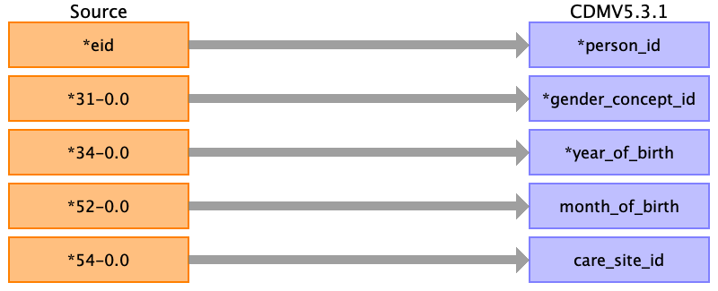

## Table name: person

### Reading from ukb8256.csv

| Destination Field | Source field | Logic | Comment field |
| --- | --- | --- | --- |
| person_id | eid |  |  |
| gender_concept_id | 31-0.0 |  | Sex |
| year_of_birth | 34-0.0 |  | Year of birth |
| month_of_birth | 52-0.0 |  | Month of birth |
| day_of_birth |  |  |  |
| birth_datetime |  |  |  |
| race_concept_id |  |  |  |
| ethnicity_concept_id |  |  |  |
| location_id |  |  |  |
| provider_id |  |  |  |
| care_site_id | 54-0.0 |  | UK Biobank assessment centre |
| person_source_value |  |  |  |
| gender_source_value |  |  |  |
| gender_source_concept_id |  |  |  |
| race_source_value |  |  |  |
| race_source_concept_id |  |  |  |
| ethnicity_source_value |  |  |  |
| ethnicity_source_concept_id |  |  |  |

